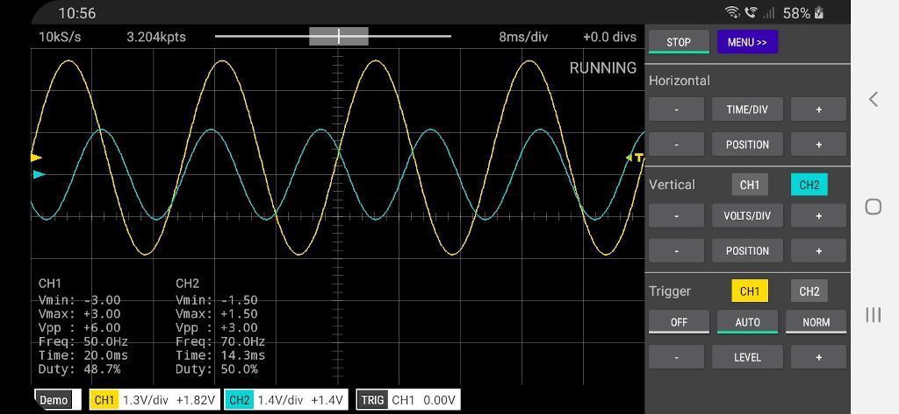
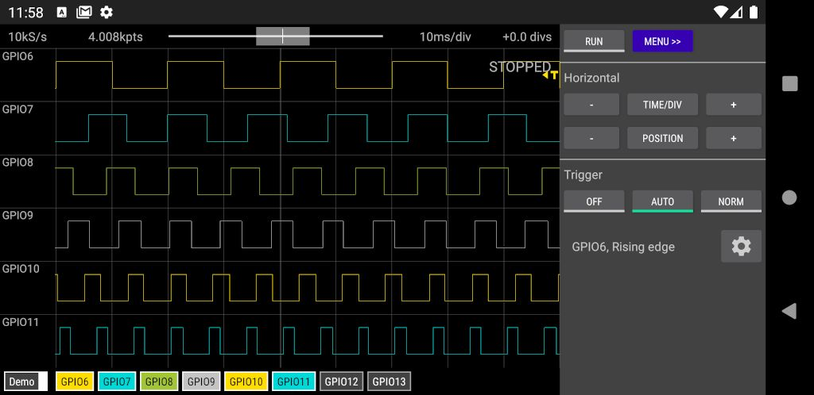

> If you are looking for the Scopy Oscilloscope by Analog Devices you can find it [here](https://wiki.analog.com/university/tools/m2k/scopy/oscilloscope).

# Scoppy
Scoppy is an oscilloscope and logic analyzer powered by your Android phone/tablet and Raspberry Pi Pico. Signals are measured by the Pico and the waveforms are displayed on the Android device. No programming is required and both the app and firmware are free to download (the [firmware](https://github.com/fhdm-dev/scoppy-pico) is open-source). Installation is super easy and should only take a few minutes.

The aim of the Scoppy project is to give electronics novices and hobbyists access to an ultra-ultra cheap oscilloscope that is useful for viewing low voltage, low frequency signals. Scoppy is also a logic analyzer with a sample rate of 25MS/s.

## What you'll need
* An Android device that's running Android version 6.0 (Marshmallow) or higher. The device must also support USB OTG (On-The-Go) - most modern phones/tablets do (if you don't see the app when browsing the Play Store then your device probably doesn't support this feature)
* A USB OTG adapter/cable compatible with your phone/tablet (available for a few dollars)
* A Rasperry Pi Pico board

> Important    
> Please use the latest versions of the App (v1.014) and Firmware (v7). Older versions of the firmware may not work with the latest version of the app and vice versa

## Quick Start

### 1. Install the Scoppy Android App
Install the [Scoppy Android app](https://play.google.com/store/apps/details?id=xyz.fhdm.scoppy) from the Play Store.

### 2. Install the firmware onto your Pico

Download the firmware onto your computer. It is here: [pico-scoppy-v7.uf2](https://fhdm-dev.github.io/downloads/scoppy-pico-v7.uf2). Alternatively you can [build the uf2 file](https://github.com/fhdm-dev/scoppy-pico) from the sources.

Press the bootsel button on your Pico and connect it to your computer. Copy the uf2 file onto your Pico. The onboard LED should start blinking.

### 3. Connect the Pico to your Phone/Tablet
Attach the OTG adapter/cable to the USB input of the Android device. The other end attaches to the USB cable you have connected to your Pico.

### 4. Start Scoppying!
Attach the +ve output of your signal source to GPIO26 of the Pico and the ground to gnd. This will allow you to measure signals between 0V and 3.3V. Of course the signal voltage should be within the allowed range of the ADC pins of the RP2040. See section 5.2.3 of the RP2040 Datasheet for more information. For Channel 2, connect the signal to GPIO27. 

> You might want to insert a current limiting resistor (eg 100R) between the signal source and the pico ADC (GPIO26/27) to limit the current through the Pico ESD diodes in case you accidentally apply a voltage higher than 3.3V.

If you don't have a suitable signal source you can view the test signal on GPIO 22 by connecting it directly to the ADC pins (GPIO 26 and 27). GPIO 22 is a 1kHz square wave with a duty cycle of 50%.

## Logic Analyzer
To use Scoppy as a logic analyzer tap the Menu button and then the Mode button and tap 'Logic Analyzer'. The logic analyzer inputs are GPIOs 6 to 13. Please remember to only apply voltages of between 0 and 3.3V to these pins.

## Detailed installation and usage instructions
See the [documentation](https://oscilloscope.fhdm.xyz/)

## Discussions/Forum
Go to the [Discussions](https://github.com/fhdm-dev/scoppy/discussions) section of this repository to well ... discuss Scoppy. For example, ask and answer questions, give feedback, request features, report bugs, share your front-end designs or comment on just about anything related to Scoppy, Oscilloscopes, Logic Analyzers or electronics in general.

## Measuring different voltage ranges (oscilloscope mode)
To remove the 0-3.3V input voltage limitation (and do whatever signal conditioning magic takes your fancy) you’ll need to add an [analog front end](https://oscilloscope.fhdm.xyz/wiki/Analog-Front-End). This can be as simple as a voltage divider or as complex as you want it to be. The [Documentation](https://oscilloscope.fhdm.xyz/) contains some [examples](https://oscilloscope.fhdm.xyz/wiki/Analog-Front-End-Examples) of simple and cheap AFE designs and you are encouraged to share your own front end designs and ideas with other Scoppiers. Just head to the [forum](https://github.com/fhdm-dev/scoppy/discussions).

## Tips
* If the traces or grid lines look too narrow then you can change the width in Settings (tap Menu to see the Settings option)
* Long-pressing most of the control buttons will set the corresponding setting to a default value eg. long-pressing the horizontal position button will reset the horizontal position back to zero. Long-pressing the trigger level button will set the trigger level to the centre of the waveform.
* Long-pressing any of the +/- buttons will continuously change the corresponding value. The longer you press it the faster the value will change.
* Tap the GND indicator (the right pointing arrow on the left of the screen) to change the selected channel. The selected channel is the one that responds to vertical swiping/zooming and tapping the vertical scale and position buttons.

## Quirks
* If the screen turns off or the app is no longer in the foreground the run mode will change to STOPPED (to prevent draining the battery). You will need to tap RUN to restart the scope.
* Tapping the phone's the back button to get back to your phone/tablet's home screen has the effect of closing the app. Tap the phone's home button instead.
* The OFF trigger mode prevents all triggering and Scoppy will set the horizonal position so that it is displaying the most recent samples (it normally tries to find a trigger point near the centre of the sample record). This may or may not be useful for viewing very slowly changing signals.

## Troubleshooting
* If the Pico doesn't seem to be connecting try the following:
    * tap STOP and then RUN
    * OR
    * unplug the USB cable and plug it back in
* If your phone has a Micro-USB connecter then check that the Micro-USB plug of the OTG cable/adapter is plugged into the phone and not into the Pico.
* If it's still not working then it's possible that your phone/tablet doesn't support USB OTG. You can test this by attaching a USB thumb drive to the OTG cable/adapter. You should be able to browse the files on the drive.
* Some diagnostic information is also writtern to the Pico UART on GPIO 0 & 1

## Specifications (oscilloscope)
* Max. Sampling Rate: 500kS/s (shared between channels)
* Time/Div: 5us - 20secs
* Memory depth depends on sampling rate. It ranges between 2kpts (shared between channels) and 20kpts in Run mode and up to 100kpts for Single shot captures.
* 2 channels

## Specifications (logic analyzer)
* Max. Sampling Rate: 25MS/s (per channel)
* Time/Div: 50ns - 100ms
* 8 channels

## Known Bugs
* When long-pressing the + or - buttons, moving your finger laterally will have the same effect as lifting your finger off the button. The only workaround is to keep your finger stready when long-pressing these buttons.

## Links
* An article on [Hackaday](https://hackaday.com/2021/06/26/raspberry-pi-pico-oscilloscope/), including many scathing reviews in the comments section. If you hate Scoppy and/or its developer then this would be a great place to vent your anger!
* Review of [Scoppy on YouTube by @Gabinete de Tecnologia](https://youtu.be/qqPxLXTxoTA)

## Tutorials/Experiments
* Here are [some tutorials and experiments](https://github.com/fhdm-dev/scoppy-experiments) demonstrating how to use Scoppy with a variety of circuits.

## Advertising and in-app purchase
The free (zero cost) version of the app is limited to one channel. A single banner ad may be displayed at the top of the screen. To enable the extra channel(s) and remove all advertising, a small in-app purchase is required (approx. US$1 for a yearly subscription or US$2 for a lifetime purchase - exact price depends on your location).

## Gallery

Screenshot

Scoppy app on a Nokia 2.1

Logic Analyzer mode

