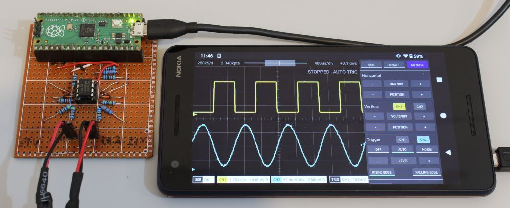
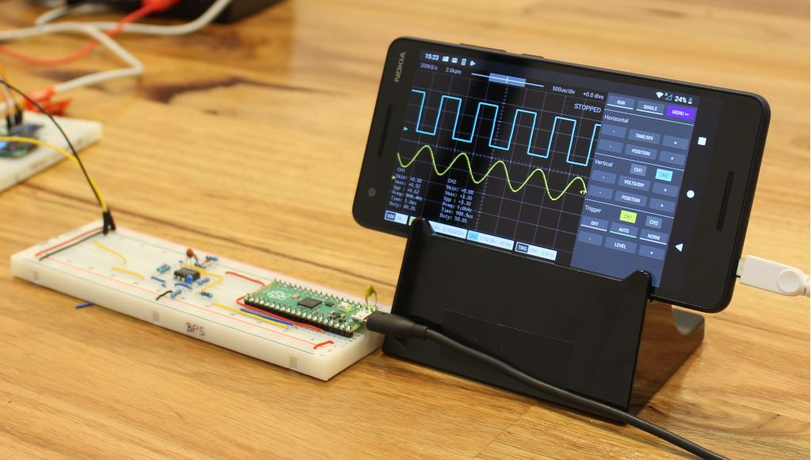
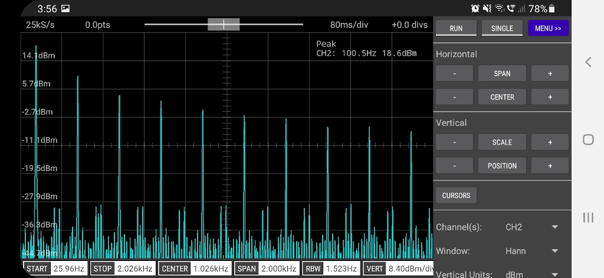
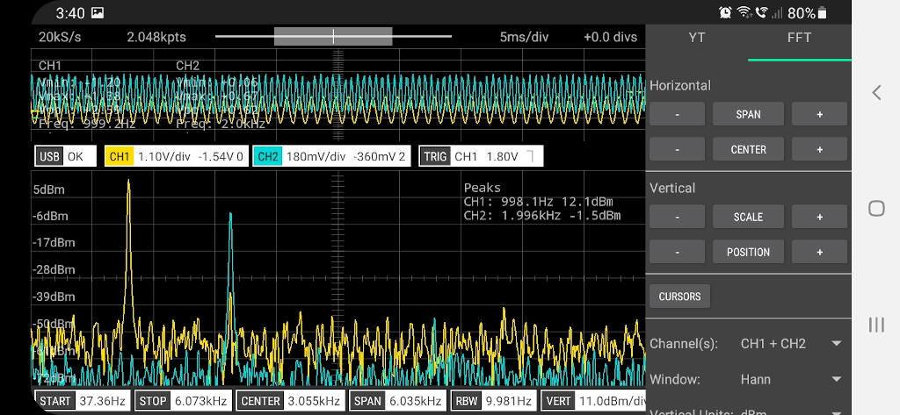
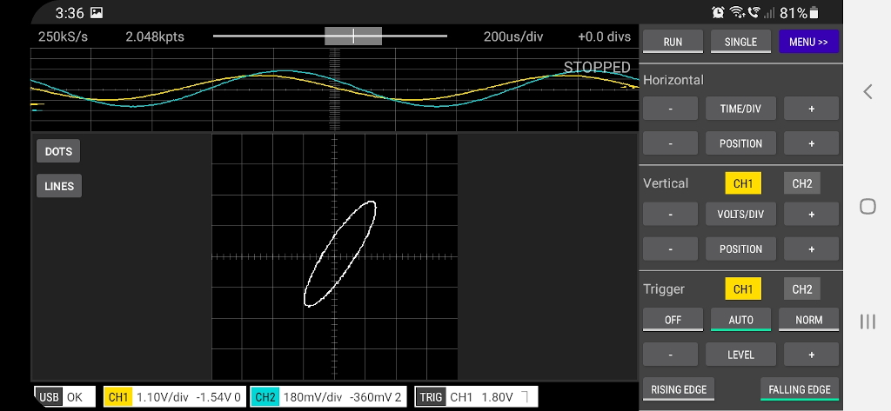

> If you are looking for the Scopy Oscilloscope by Analog Devices you can find it [here](https://wiki.analog.com/university/tools/m2k/scopy/oscilloscope).

# Scoppy
Scoppy is an oscilloscope and logic analyzer powered by your Android phone/tablet and Raspberry Pi Pico or Pico W. Signals are measured by the Pico and the waveforms are displayed on the Android device. No programming is required and both the app and firmware are free to download1. Installation is super easy and should only take a few minutes.

The Pico W version allows you to use your phone/tablet as the oscilloscope display without the need for a physical connection between your phone and the Pico W.

The aim of the Scoppy project is to give electronics novices and hobbyists and STEM students access to an ultra-ultra cheap oscilloscope that is useful for viewing low voltage, low frequency signals. Scoppy is also a logic analyzer with a sample rate of 25MS/s.

## What you'll need
* An Android device that's running Android version 6.0 (Marshmallow) or higher. The device must also support USB OTG (On-The-Go) - most modern phones/tablets do (if you don't see the app when browsing the Play Store then your device probably doesn't support this feature)
* A USB OTG adapter/cable compatible with your phone/tablet (not required when using the Pico W and connecting via Wi-Fi)
* A Rasperry Pi Pico or Pico W board

> Important    
> Please use the latest versions of the App (v1.020) and Firmware (v11 for the Pico, v12 for the Pico W). Older versions of the firmware may not work with the latest version of the app and vice versa

## Getting started

See the [Installation and Getting Started](https://oscilloscope.fhdm.xyz/wiki/Installation-&-Getting-Started) guide.

## Want more information?
Start at the [documentation](https://oscilloscope.fhdm.xyz/) index.

## Discussions/Forum
Go to the [Discussions](https://github.com/fhdm-dev/scoppy/discussions) section of this repository to well ... discuss Scoppy. For example, ask and answer questions, give feedback, request features, report bugs, share your front-end designs or comment on just about anything related to Scoppy, Oscilloscopes, Logic Analyzers or electronics in general.

## Measuring different voltage ranges (oscilloscope mode)
To remove the 0-3.3V input voltage limitation (and do whatever signal conditioning magic takes your fancy) you’ll need to add an [analog front end](https://oscilloscope.fhdm.xyz/wiki/Analog-Front-End). This can be as simple as a voltage divider or as complex as you want it to be. The [Documentation](https://oscilloscope.fhdm.xyz/) contains some [examples](https://oscilloscope.fhdm.xyz/wiki/Analog-Front-End-Examples) of simple and cheap AFE designs.
   
[Here's](https://github.com/fhdm-dev/scoppy/discussions/63) an example of a two channel, super-cheap front end that is easy to build and uses readily available components. This front end features high input impedance and over/under voltage protection. 

            

Or for something a bit more fancy, here's a front-end that automatically adjusts the sensitivity (input voltage range) as you change the volts/div setting in the app. It also features 10X probe compatibility, an input impedance of 1M||22pF and status LEDs for triggering and Wi-Fi. The schematic and PCB design can be found [here at OSHWLab](https://oshwlab.com/fruitloop57/fscope-250k5-v2_copy). The boards can also be purchased at the [FHDM store](https://store.fhdm.xyz/home).

## Tips
* If the traces or grid lines look too narrow then you can change the width in Settings (tap Menu to see the Settings option)
* Long-pressing most of the control buttons will set the corresponding setting to a default value eg. long-pressing the horizontal position button will reset the horizontal position back to zero. Long-pressing the trigger level button will set the trigger level to the centre of the waveform.
* Long-pressing any of the +/- buttons will continuously change the corresponding value. The longer you press it the faster the value will change.
* Tap the GND indicator (the right pointing arrow on the left of the screen) to change the selected channel. The selected channel is the one that responds to vertical swiping/zooming and tapping the vertical scale and position buttons.

## Quirks
* If the screen turns off or the app is no longer in the foreground, the run mode will change to STOPPED (to prevent draining the battery). You will need to tap RUN to restart the scope.
* The OFF trigger mode prevents all triggering and Scoppy will set the horizonal position so that it is displaying the most recent samples (it normally tries to find a trigger point near the centre of the sample record). This in combination with a long Time/Div setting is equivalent to roll mode on many 'scopes. 

## Troubleshooting
* If your phone has a Micro-USB connecter then check that the Micro-USB plug of the OTG cable/adapter is plugged into the phone and not into the Pico!
* If the Pico doesn't seem to be connecting try the following:
    * tap STOP and then RUN
    * OR
    * unplug the USB cable and plug it back in
* If it's still not working then it's possible that your phone/tablet doesn't support USB OTG. You can test this by attaching a USB thumb drive to the OTG cable/adapter. You should be able to browse the files on the drive.
* Some diagnostic information is also writtern to the Pico UART on GPIO 0 & 1
* If using a Pico W see the [Wi-Fi troubleshooting](https://oscilloscope.fhdm.xyz/wiki/WiFi-Troubleshooting) page

## Specifications and features (oscilloscope)
* Max. Sampling Rate: 500kS/s (shared between channels)
* Time/Div: 5us - 20secs
* Memory depth depends on sampling rate. It ranges between 2kpts (shared between channels) and 20kpts in Run mode and up to 100kpts for Single shot captures.
* 2 channels
* Auto and Normal triggering
* Cursors
* X-Y Mode
* FFT
* Wireless connectivity

## Specifications (logic analyzer)
* Max. Sampling Rate: 25MS/s (per channel)
* Time/Div: 50ns - 100ms
* 8 channels

## Known Bugs
* When long-pressing the + or - buttons, moving your finger laterally will have the same effect as lifting your finger off the button. The only workaround is to keep your finger stready when long-pressing these buttons.

## Reviews
* [Video by PicoLABO](https://youtu.be/LuLxhp1vdMQ) showing how to build a high impedance analog front end for Scoppy with over/under voltage protection
* [Another AFE design by PicoLABO](https://youtu.be/LRcMg56Tius)
* [Demonstration of Scoppy](https://www.youtube.com/watch?v=8ldxmyujHK8&t=4523s) on the DroneBot Workshop channel
* Review of [Scoppy on YouTube by @Gabinete de Tecnologia](https://youtu.be/qqPxLXTxoTA)
* An article on [Hackaday](https://hackaday.com/2021/06/26/raspberry-pi-pico-oscilloscope/), including many scathing reviews in the comments section. If you hate Scoppy and/or its developer then this would be a great place to vent your anger!

## Tutorials/Experiments
* Here are [some tutorials and experiments](https://github.com/fhdm-dev/scoppy-experiments) demonstrating how to use Scoppy with a variety of circuits.

## Links
* The Scoppy [Android app](https://play.google.com/store/apps/details?id=xyz.fhdm.scoppy) on the Play Store
* Scoppy [documentation](https://oscilloscope.fhdm.xyz/)
* Scoppy on Twitter - [@ScoppyScope](https://twitter.com/ScoppyScope)
* Scoppy [channel on hackster.io](https://www.hackster.io/scoppy)
* The Scoppy channel on [YouTube](https://www.youtube.com/channel/UCD006Xn-C9mPuT_jTxH3JHQ)

## 1Advertising and in-app purchase
The free (zero cost) version of the app is limited to one channel and USB. A single banner ad may be displayed at the top of the screen. To enable the extra channel(s) and wireless support and remove all advertising, a small in-app purchase is required (approx. US$2 for a lifetime purchase - exact price depends on your location).

## Gallery

Screenshot

Scoppy app on a Nokia 2.1

Logic Analyzer mode

FFT of a square wave

FFT showing both channels and the YT (scope) window

X-Y and YT displayed simultaneously

Scoppy and the [FHDM DSO-500K](https://store.fhdm.xyz/dso-500k) Oscilloscope

