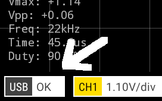

### 1. Install the Android App
Install the [Scoppy Android app](https://play.google.com/store/apps/details?id=xyz.fhdm.scoppy) from the Play Store.

### 2. Erase Existing Data from Pico Flash

Erase all existing data from the Pico (or Pico W) flash by following the instructions here: [Erase Flash](../wiki/erase-flash)

> Important. Failure to erase existing data from the flash storage may result in the Scoppy firmware not working correctly or at all!

### 3. Download and Install the Firmware

Download the firmware onto your computer from [here](./firmware-versions)

After erasing the flash using the instructions above (step 2), the Pico should be visible on your computer as a mass storage device. 

> If you don't see the Pico on your computer as a mass storage device then push and hold the BOOTSEL button on the Pico and connect it to your computer using a normal USB cable (Type-A male to Micro-USB male). Your computer should detect the Pico as a USB Mass Storage device. Release BOOTSEL once the drive RPI-RP2 appears on your computer.

Copy the firmware uf2 file to the mass storage device.

The onboard LED should start blinking.

### 4. Connect the Pico or Pico W to your Phone/Tablet

Communication between the firmware on the Pico (or Pico W) and app on the phone/tablet can be either via USB or Wi-Fi (Pico W only). 

#### a. USB

> Please note that if you are using a Pico W and a connection over USB hasn’t been established within 10 seconds of powering up the board, the Pico W will start listening to connections over Wi-Fi. To try connecting via USB again the Pico W will need to be restarted.

Open the app and look at the connection badge at the lower left of the app screen and check that the connection type is set to USB. If it isn't USB, tap the badge and then tap 'Change connection type' from the menu and then select USB.

Attach the small end of the OTG cable/adapter to the USB input of the Android device (do NOT plug it into the USB socket of the Pico!). Then use a USB cable to connect the OTG cable/adapter to the Pico (or Pico W). You should see the status LED on the Pico start blinking. 

Android will now probably ask permission for the Scoppy app to access USB. Tap Yes/OK.

Once a connection is established between the Pico and the Scoppy app the onboard LED should stop blinking. You may need to tap the 'Run' button in the app if the scope is currently stopped (Scoppy will either be RUNNING or STOPPED. This status is displayed at the top right of the grid).

The connection badge should now display 'USB OK'

 

Please note that if you are using a Pico W and a connection over USB hasn’t been established within 10 seconds the Pico W will start listening to connections over Wi-Fi. To try connecting via USB again simply unplug the OTG adapter and then try again.

__USB connection troubleshooting__

If a connection cannot be established over USB then check the following:
* Make sure the OTG adapter is plugged into the Android device and not the Oscilloscope. If using a Micro-USB adaptor it is possible to get this the wrong way around.
* Do not use other adapters between the Android device and oscilloscope. For example, using a Type-C to Micro USB adapter between the OTG adapter and phone will prevent
a connection being established.
* If the Wi-Fi LED is blinking, unplug the OTG adapter from the Android device and then try again.
* Ensure the correct firmware has been installed. You can do this by repeating steps 2 and 3.
* Check that the USB cable is not a 'power-only' cable.

#### b. Wi-Fi (Pico W)

Please see [Getting started with Scoppy and the Pico W](./Getting-started-with-the-Pico-W). Once connected, continue to Step 5 below.

### 5. Connect a signal source
Attach the +ve output of your signal source to GPIO26 of the Pico and the ground to gnd. This will allow you to measure signals between 0V and 3.3V. Of course the signal voltage should be within the allowed range of the ADC pins of the RP2040. See section 5.2.3 of the RP2040 Datasheet for more information. For Channel 2, connect the signal to GPIO27. 

> You might want to insert a current limiting resistor (eg 100R) between the signal source and the pico ADC (GPIO26/27) to limit the current through the Pico ESD diodes in case you accidentally apply a voltage higher than 3.3V.

If you don't have a suitable signal source you can view the test signal on GPIO 22 by connecting it directly to the ADC pins (GPIO 26 and 27). GPIO 22 is a 1kHz square wave with a duty cycle of 50%.

To measure signals outside of the 0 to 3.3V range of the Pico ADCs you will need some form of circuitry between your signal source and the Pico ADC. See the [Analog Front-End](../wiki/Analog-Front-End) documentation for more information.

 

Test signal connected to GPIO 26. Horizontal time/div needs adjusting :)

 
### Logic Analyzer Mode
To use Scoppy as a logic analyzer tap the Menu button and then the Mode button and tap 'Logic Analyzer'. The logic analyzer inputs are GPIOs 6 to 13. Please remember to only apply voltages of between 0 and 3.3V to these pins.

 

